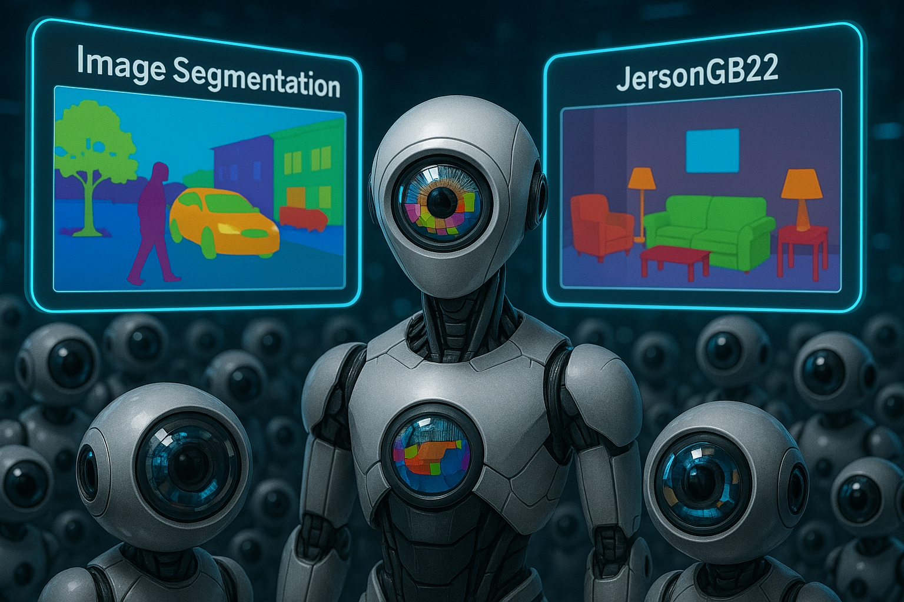
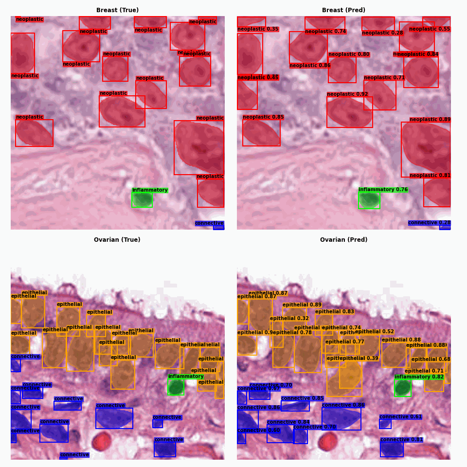
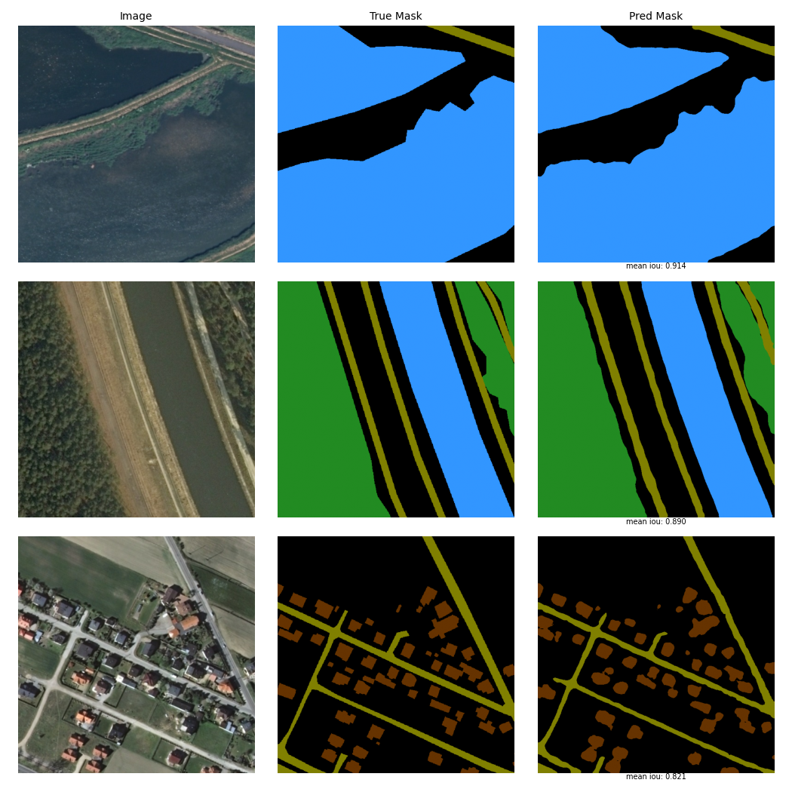
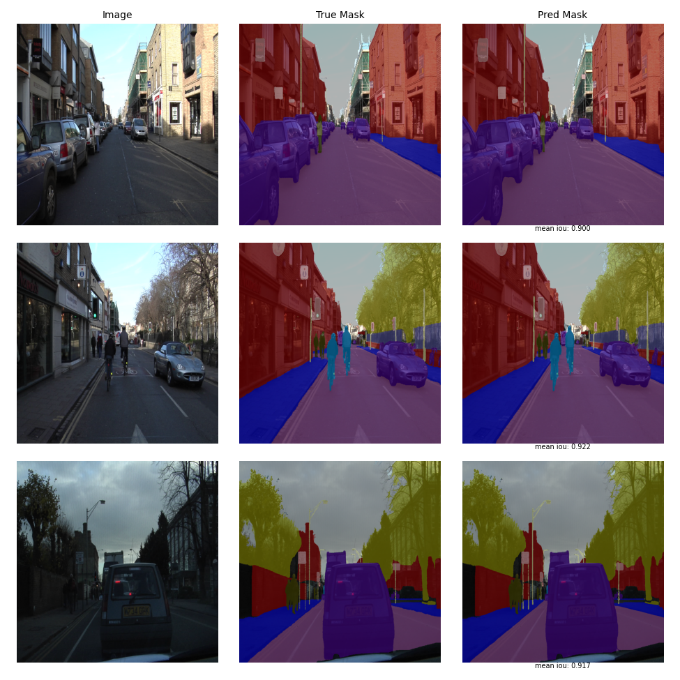
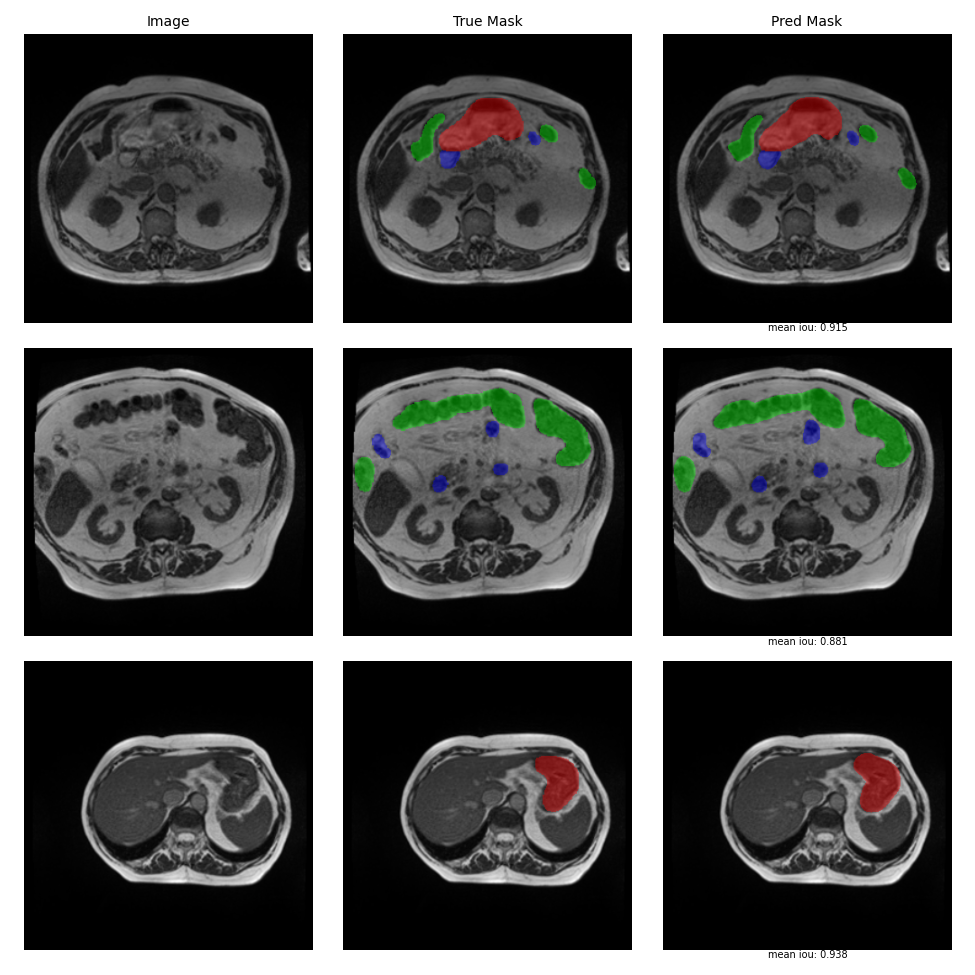
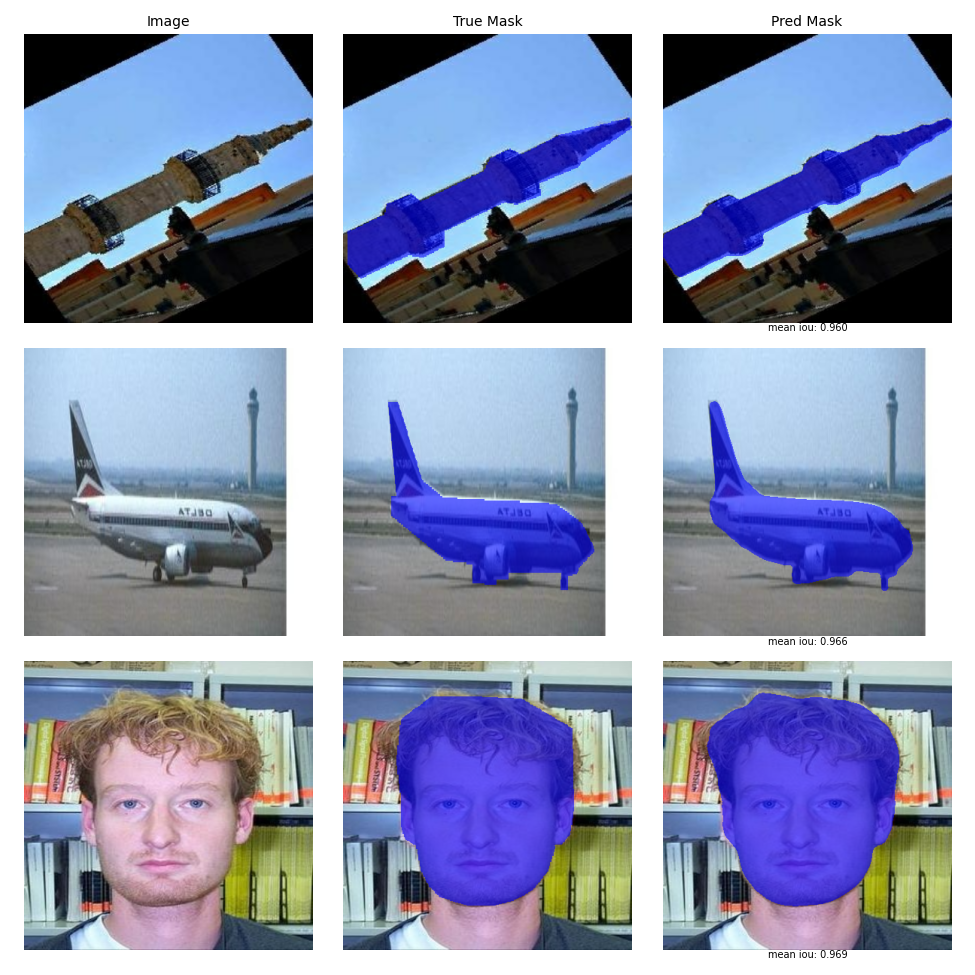
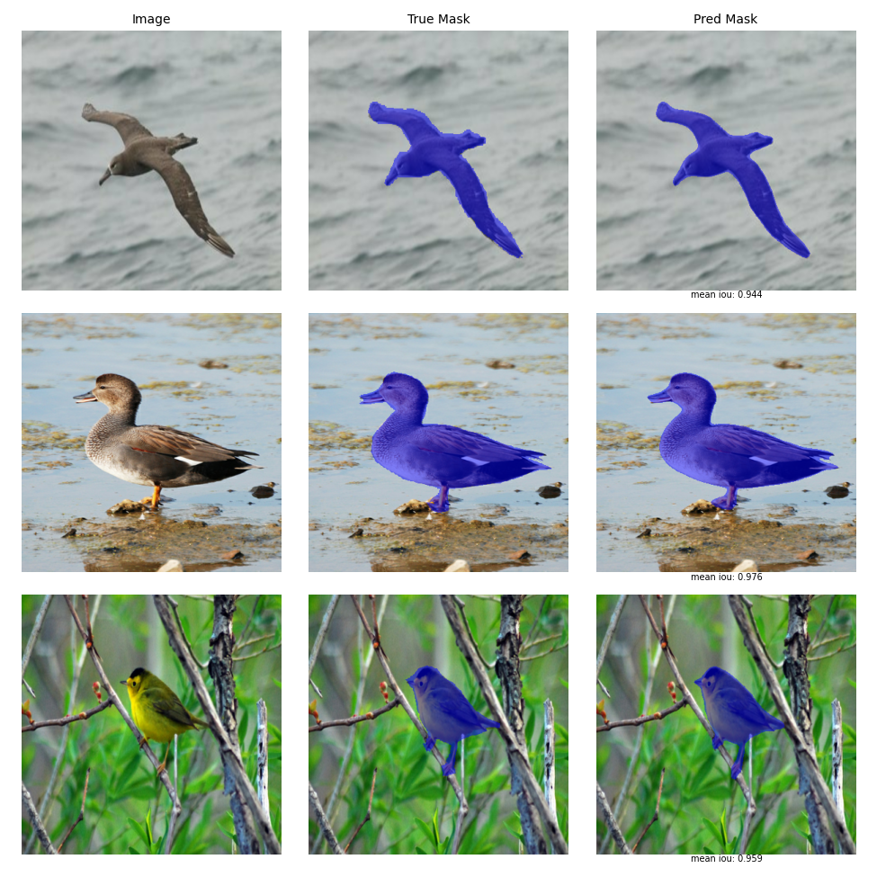
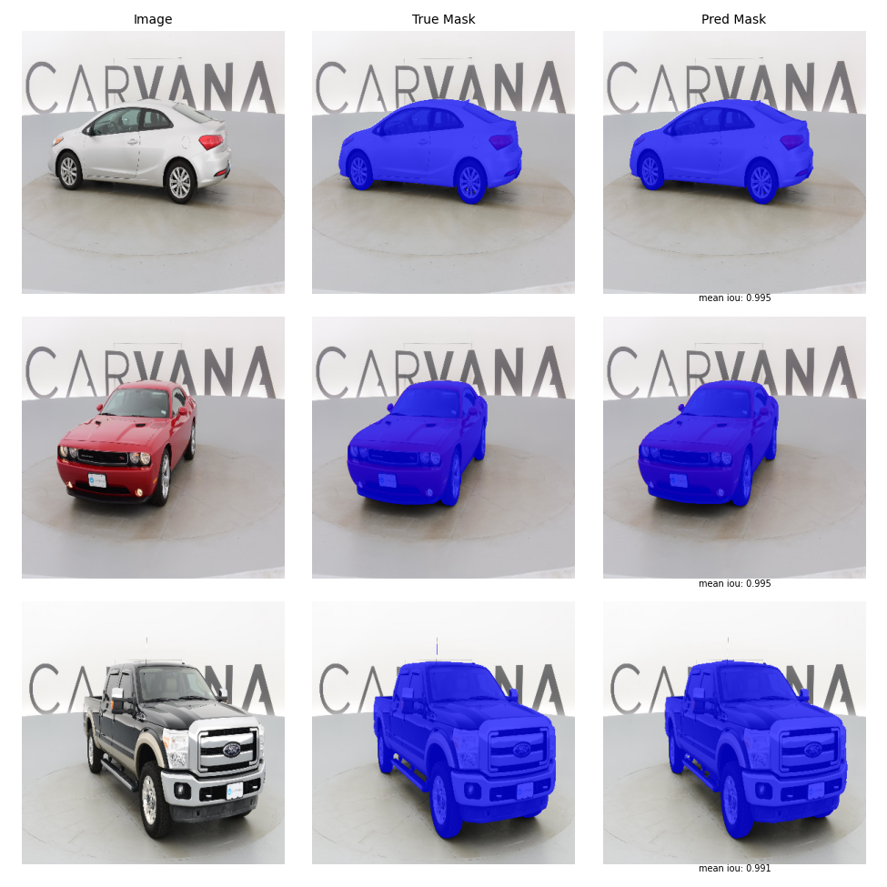

# <h1 align="center">**Image Segmentation**</h1>

 

This repository presents the implementation of **Image Segmentation** models, a task in the field of **Computer Vision** that involves classifying each pixel in an image into a category or a specific instance of a category. This task can be divided into three types:

- **Semantic segmentation:** Assigns a class label to each pixel in an image without distinguishing between different instances of the same class.

- **Instance segmentation:** Goes beyond **Object Detection** by labeling each pixel that belongs to a detected object with a specific class and instance. In this way, the models not only provide the coordinates of the bounding box, along with class labels and confidence scores, but also generate binary masks for each detected instance in an image.

- **Panoptic segmentation:** Combines semantic segmentation and instance segmentation by assigning each pixel in an image both a class and an instance label. This allows for a detailed segmentation of complex scenes.

Currently, image segmentation is used in a wide range of highly important fields. It plays a key role in **medicine** by helping identify and analyze tissues and tumors in diagnostic images; in **autonomous driving**, where it aids in detecting and classifying roads, pedestrians, and obstacles; in **environmental monitoring**, by using satellite images to classify different types of terrain and detect changes; in **robotics**, enabling precise object localization and manipulation; and in **augmented reality and video editing**, improving the integration of digital elements into real-world scenes.

## **Implemented Models:**

Some of the models in this repository are built and trained from scratch using **Convolutional Neural Networks (CNNs)**. In other cases, **fine-tuning** is applied through **transfer learning**, making use of high-performing pretrained models such as **Transformers** and **YOLO11-seg**, trained on large datasets. These projects use frameworks like [TensorFlow](https://www.tensorflow.org/api_docs), [PyTorch](https://pytorch.org/docs/stable/index.html), [Hugging Face](https://huggingface.co/), and [Ultralytics](https://docs.ultralytics.com/).

In addition, training and fine-tuning are carried out using hardware resources such as **TPUs** or **GPUs** available in **Google Colab**, depending on the project's requirements.

Most of the notebooks in this repository include **data augmentation** techniques applied to the training set to improve the model's generalization ability. These techniques are implemented manually using libraries like [Albumentations](https://albumentations.ai/docs/) or automatically (e.g., with YOLO11). Strategies such as **callbacks** and **learning rate schedulers** are also used to prevent overfitting and achieve optimal performance.

Below are the evaluation results of the models implemented to date. In cases where the validation or test set is unavailable or not publicly accessible, the evaluation was performed exclusively on the available split.

### 📊 Panoptic Segmentation 

| Dataset | Domain | Model | $\text{PQ}$ | $\text{SQ}$ | $\text{RQ}$ | Eval. Set |
|---------|--------|-------|----|----|----|-----------|
| [LaRS](https://arxiv.org/pdf/2308.09618) | Maritime obstacle detection | Mask2Former-Swin-Tiny | 0.564 | 0.791 | 0.686 | Validation |

---

### 📊 Instance Segmentation 

| Dataset | Domain | Model | $\text{mAP}^{\text{mask}}_{50}$ | $\text{mAP}^{\text{mask}}_{50-95}$ | Eval. Set |
|---------|--------|-------|---------------------------------|------------------------------------|-----------|
| [SBD](https://github.com/shelhamer/fcn.berkeleyvision.org/blob/master/data/pascal/README.md) | General object segmentation | YOLO11l-seg | 0.895 | 0.719 | Validation |
| [PanNuke](https://arxiv.org/pdf/2003.10778) | Histopathology (nucleus segmentation) | YOLO11s-seg | 0.700 / 0.692 | 0.464 / 0.455 | Validation / Test |
| [USIS10K](https://github.com/liamlian0727/usis10k) | Underwater scene analysis | YOLO11l-seg | 0.634 / 0.635 | 0.490 / 0.495 | Validation / Test |
| [BDD100K](https://github.com/bdd100k/bdd100k/) | Autonomous driving | YOLO11m-seg | 0.464 | 0.266 | Validation |

---

### 📊 Semantic Segmentation 

| Dataset | Domain | Model | $\text{mIoU}$ | $\text{Dice Score}$ | Eval. Set |
|---------|--------|-------|------|------------|-----------|
| [UW-Madison GI Tract](https://www.kaggle.com/competitions/uw-madison-gi-tract-image-segmentation/) | Medical imaging (gastrointestinal tract) | SegFormer-B3 | 0.900 | 0.946 | Validation |
| [LandCover.ai](https://arxiv.org/pdf/2005.02264v4) | Aerial land‑cover classification | SegFormer-B3 | 0.870 / 0.872 | 0.928 / 0.929 | Validation / Test |
| [CamVid](https://mi.eng.cam.ac.uk/research/projects/VideoRec/CamVid/) | Autonomous driving | SegFormer-B2 | 0.869 | 0.927 | Validation |
| [Carvana](https://www.kaggle.com/competitions/carvana-image-masking-challenge/) | Binary segmentation of cars | U-Net | 0.995 | 0.997 | Validation |
| [CUB-200-2011](https://www.vision.caltech.edu/datasets/cub_200_2011/) | Binary segmentation of 200 bird species | ConvNeXt-Base U-Net | 0.955 | 0.977 | Test |
| [Caltech-101](https://data.caltech.edu/records/mzrjq-6wc02) | Binary segmentation of 101 object classes | ConvNeXt-Base U-Net | 0.932 | 0.965 | Test |

## **Visual Results on Multiple Datasets**

  <h2><b>LaRS</b></h2>
  

---

  <h2><b>BDD100K</b></h2>
  

---

  <h2><b>USIS10K</b></h2>
  

---

  <h2><b>SBD</b></h2>
  

---

  <h2><b>PanNuke</b></h2>
  

---

  <h2><b>LandCover.ai</b></h2>
  

---

  <h2><b>CamVid</b></h2>
  

---

  <h2><b>UW-Madison GI Tract</b></h2>
  

---

  <h2><b>Caltech-101</b></h2>
  

---

  <h2><b>CUB-200-2011</b></h2>
  

---

  <h2><b>Carvana</b></h2>
  

#### *More results can be found in the respective notebooks.*

## **Technological Stack**
 

[![Ultralytics](https://img.shields.io/badge/Ultralytics-1572B6?style=for-the-badge&logo=data:image/svg+xml;base64,PHN2ZyB4bWxucz0iaHR0cDovL3d3dy53My5vcmcvMjAwMC9zdmciIGZpbGw9Im5vbmUiIHZpZXdCb3g9IjAgMCAyNTIgMjY0IiBoZWlnaHQ9IjI2NCIgd2lkdGg9IjI1MiI+CjxnIGNsaXAtcGF0aD0idXJsKCNjbGlwMF8xMDA4Xzk0MTc3KSI+CjxtYXNrIGhlaWdodD0iMjU4IiB3aWR0aD0iMjU0IiB5PSI2IiB4PSItMSIgbWFza1VuaXRzPSJ1c2VyU3BhY2VPblVzZSIgc3R5bGU9Im1hc2stdHlwZTpsdW1pbmFuY2UiIGlkPSJtYXNrMF8xMDA4Xzk0MTc3Ij4KPHBhdGggZmlsbD0id2hpdGUiIGQ9Ik0yNTIuMzkxIDYuMDY3ODFILTAuNDM3NVYyNjMuOTMySDI1Mi4zOTFWNi4wNjc4MVoiPjwvcGF0aD4KPC9tYXNrPgo8ZyBtYXNrPSJ1cmwoI21hc2swXzEwMDhfOTQxNzcpIj4KPHBhdGggZmlsbD0iIzBCMjNBOSIgZD0iTTU4Ljc1IDYuMDY4NTFDMjYuMTEzNiA2LjA2ODUxIC0wLjQzNzUgMzIuNjMxOCAtMC40Mzc1IDY1LjI4MjlDLTAuNDM3NSA5Ny45MzE0IDI2LjExMzYgMTI0LjQ5NiA1OC43NSAxMjQuNDk2QzkxLjM4NyAxMjQuNDk2IDExNy45MzggOTcuOTMxNCAxMTcuOTM4IDY1LjI4MjlDMTE3LjkzOCAzMi42MzE4IDkxLjM4NyA2LjA2ODUxIDU4Ljc1IDYuMDY4NTFaIj48L3BhdGg+CjxwYXRoIGZpbGw9IiMwQjIzQTkiIGQ9Ik0xMjUuNzE5IDE5MS40ODlDMTA0LjM5OSAxOTEuNDg5IDg0LjI1NDIgMTg2LjA4OCA2Ni41NzAzIDE3Ni42MDZWMjAzLjQ3MUM2Ni41NzAzIDIzNi4wNzEgOTIuNTg5OSAyNjMuMTIxIDEyNS4xNzUgMjYzLjQzNkMxNTguMDc4IDI2My43NTQgMTg0Ljk0NyAyMzcuMDY5IDE4NC45NDcgMjA0LjIyNlYxNzYuNTgxQzE2Ny4yNDcgMTg2LjA4NyAxNDcuMDY5IDE5MS40ODkgMTI1LjcxOSAxOTEuNDg5WiI+PC9wYXRoPgo8cGF0aCBmaWxsPSJ1cmwoI3BhaW50MF9saW5lYXJfMTAwOF85NDE3NykiIGQ9Ik0xMzMuNDY2IDY1LjI4OTVDMTMzLjQwNSAxMDYuNDgxIDk5Ljk3OTYgMTM5LjkzNCA1OC42NTg0IDE0MC4wMzVDNDIuNzE4NSAxNDAuMDc2IDI3Ljc2MDcgMTM1LjExMiAxNS41NTQ3IDEyNi40NDVDMzcuMTg4OCAxNjUuMTM0IDc4LjQ3MDEgMTkxLjUxNCAxMjUuNjczIDE5MS40MjNDMTk0LjI0MyAxOTEuNDc3IDI1MC44MjMgMTM1LjYyNiAyNTEuOTY2IDY3LjEyNTNMMjUxLjgwNCA2Ni45Nzg3QzI1MS44NzEgNjUuMjcxOSAyNTEuNzg4IDY2LjY3IDI1MS44NzEgNjUuMjcxOUMyNTEuOTA0IDMyLjU5OCAyMjUuMzEyIDUuOTMxMDEgMTkyLjgxNSA2LjA0NDc3QzE2MC4wMDggNi4xNzQzMiAxMzMuNDk5IDMyLjYxNTIgMTMzLjQ2NiA2NS4yODk1WiI+PC9wYXRoPgo8L2c+CjwvZz4KPGRlZnM+CjxsaW5lYXJHcmFkaWVudCBncmFkaWVudFVuaXRzPSJ1c2VyU3BhY2VPblVzZSIgeTI9IjI3LjA1MjciIHgyPSIyMTcuNzA4IiB5MT0iMTg5LjMyOCIgeDE9IjcxLjE1NTIiIGlkPSJwYWludDBfbGluZWFyXzEwMDhfOTQxNzciPgo8c3RvcCBzdG9wLWNvbG9yPSIjMDlEQkYwIj48L3N0b3A+CjxzdG9wIHN0b3AtY29sb3I9IiMwQjIzQTkiIG9mZnNldD0iMSI+PC9zdG9wPgo8L2xpbmVhckdyYWRpZW50Pgo8Y2xpcFBhdGggaWQ9ImNsaXAwXzEwMDhfOTQxNzciPgo8cmVjdCBmaWxsPSJ3aGl0ZSIgaGVpZ2h0PSIyNjQiIHdpZHRoPSIyNTIiPjwvcmVjdD4KPC9jbGlwUGF0aD4KPC9kZWZzPgo8L3N2Zz4K&logoColor=white&labelColor=101010)](https://docs.ultralytics.com/)

## **Contact**

